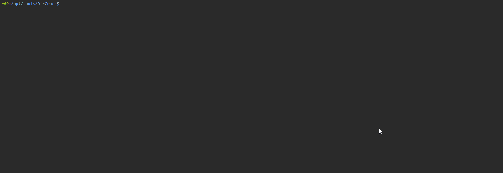

# 目录扫描工具

## 介绍

- 协程扫描

- 扫描速率控制

- 多站点扫描时循环扫描，均分单个站点产生的流量

- 自动探测目录不存在时的响应格式

- 可选的手动指定目录不存在时的响应格式


## 使用

```bash
    .___.__                             __
  __| _/|__|______   ________________  |  | __ ____
 / __ | |  \_  __ \_/ ___\_  __ \__  \ |  |/ // __ \
/ /_/ | |  ||  | \/\  \___|  | \// __ \|    <\  ___/
\____ | |__||__|    \___  >__|  (____  /__|_ \___  >
     \/                 \/           \/     \/    \/


usage: dircrack.py [-h] [-u URL] [-fu FILE_URL] [-d DIC] [-A AGENT] [-H HEAD]
                   [-X EXT] [-r RATE] [-p PROXY] [--allow-redirect]
                   [-o OUTPUT] [--invalid-page INVALID_PAGES]

optional arguments:
  -h, --help            show this help message and exit
  -u URL, --url URL     Base URL to scan
  -fu FILE_URL, --file-url FILE_URL
                        Base URL from File
  -d DIC, --dic DIC     Default dictionary: ./dic/common.txt
  -X EXT, --ext EXT     Amplify search with extensions
  -A AGENT, --agent AGENT
                        Specify your custom UserAgent
  -H HEAD, --Head HEAD  Add a custom header to the HTTP request
  -p PROXY, --proxy PROXY
                        Scan using a proxy
  -r RATE, --rate RATE  Scan rate(Minute)
  --allow-redirect      Allow redirect
  -o OUTPUT, --output-file OUTPUT
                        Save output to disk
  --invalid-page INVALID_PAGES
                        Invalid page format: status_code:content

```

## 详细说明

- 指定目标

    `-u` 指定单个url，`-fu`指定一个待扫描的文件，里面的url以换行分隔，二者必选其一

- 扫描字典

    `-d` 设置要使用的字典。

    `-X`设定要使用的后缀，可指定多个，例如  `-X "" -X "php" -X "jsp"` 将会以 `原路径`、 `.php`、 `.jsp` 进行扫描

- 请求设置

    `-A`指定要使用的 User-Agent。

    `-H` 指定要使用的请求头，可设置多个，例：`-H DNT:1 -H token:xxxxxxxx`

    `-p` 设置代理，例：`-p http://127.0.0.1:8080`

    `-r` 一分钟内发送的请求数量，默认900

    `--allow-redirect` 是否进行重定向，默认False

- 输出

    `-o` 输出文件

- 扫描规则

    扫描时会默认探测待扫描站点的规则，若设置 `--invalid-page`则不再探测扫描规则，直接以该参数中的规则为准

    `--invalid-page`可设置多个，格式为： `status_code: include_content`

    例： `--invalid-page "404:Not Found" --invalid-page "200:Not Found" --invalid-page ":Error Code"`

    将会以 :

    - 404 且响应体中有`Not Found`的页面为无效页面
    - 200 且响应体中有`Not Found`的页面为无效页面
    - 忽略响应状态码，只要请求中有`Error Code`就认为该页面为无效页面


